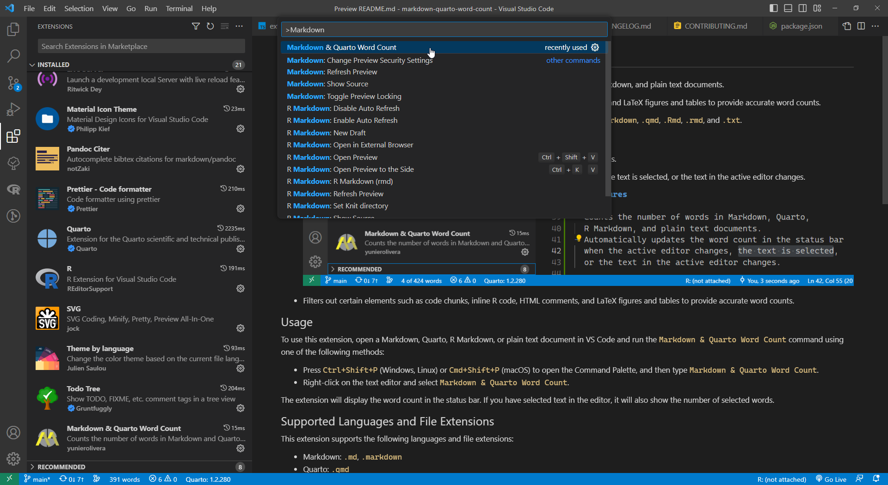

# Markdown & Quarto Word Count

This VS Code extension allows users to count the number of words in Markdown, Quarto, R Markdown, and plain text documents.

The extension filters out several elements such as YAML metadata, code chunks, inline R code, HTML comments, and LaTeX figures and tables to provide accurate word counts.

This extension can only count words in supported document types with the extensions `.md`, `.markdown`, `.qmd`, `.Rmd`, `.rmd`, and `.txt`.

## Features

- Counts the number of words in Markdown, Quarto, R Markdown, and plain text documents.
- Automatically updates the word count in the status bar when the active editor changes, the text is selected, or the text in the active editor changes.

  

- Filters out certain elements such as code chunks, inline R code, HTML comments, and LaTeX figures and tables to provide accurate word counts.

## Usage

To use this extension, open a Markdown, Quarto, R Markdown, or plain text document in VS Code and run the `Markdown & Quarto Word Count` command using one of the following methods:

- Press `Ctrl+Shift+P` (Windows, Linux) or `Cmd+Shift+P` (macOS) to open the Command Palette, and then type `Markdown & Quarto Word Count`.
- Right-click on the text editor and select `Markdown & Quarto Word Count`.

The extension will display the word count in the status bar. If you have selected text in the editor, it will also show the number of selected words.

## Supported Languages and File Extensions

This extension supports the following languages and file extensions:

- Markdown: `.md`, `.markdown`
- Quarto: `.qmd`
- RMarkdown: `.Rmd`, `.rmd`
- Plain text: `.txt`

If you open a file that does not have one of these extensions, the status bar item will not appear.

## Notes

This extension counts words based on the text content of the document. It does not include any formatting elements, such as headings, bold or italic text, or hyperlinks.

If you use other elements in your Markdown, Quarto, or R Markdown documents, such as footnotes or citations, they will not be counted as words. This extension only counts words based on the visible text in the document.

This extension does not count words in images, LaTeX equations, or other non-text elements in your document.

## Contributing

If you want to contribute to this project, please read the [contribution guidelines](CONTRIBUTING.md) first.

## Acknowledgments

This extension was inspired by the `wordcountaddin` repository, an RStudio add-in for word counting, available at https://github.com/benmarwick/wordcountaddin.git.

## License

This extension is licensed under the MIT License. See the `LICENSE` file for details.
